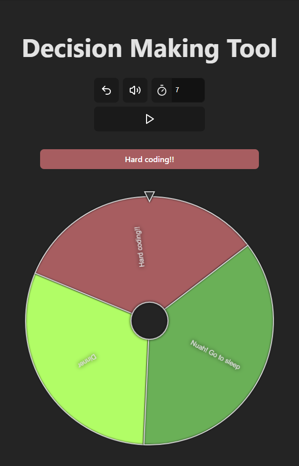

# Decision Making Tool 🎡

A powerful customizable spinning wheel application for random decision making with advanced options management. Built with Vue 3, TypeScript, and Vite.



## Features ✨

- 🎯 **Interactive Wheel** - Smooth spinning animation with physics-based stopping
- ⚖️ **Weighted Options** - Assign custom probabilities to each choice
- 💾 **Data Management**:
  - Save/Load options as JSON files
  - Import CSV-style text to quickly populate options
- 🎨 **Automatic Color Generation** - Vibrant, distinguishable segment colors
- 🔊 **Sound Effects** - With mute toggle (start/picked sounds)
- ⚡ **Quick Input** - Add multiple options at once with text parsing
- 📱 **Fully Responsive** - Works on all device sizes
- 🔄 **State Persistence** - Remembers your settings and options
- 🛠️ **Developer Friendly** - Modern tooling and type safety

## Technologies Used 🛠️

- [Vue 3](https://vuejs.org/) (Composition API)
- [TypeScript](https://www.typescriptlang.org/) (Type safety)
- [Vite](https://vitejs.dev/) (Blazing fast builds)
- [Pinia](https://pinia.vuejs.org/) (State management)
- [Sass](https://sass-lang.com/) (Advanced styling)
- [Vue Router](https://router.vuejs.org/) (Navigation)

## Installation 💻

```
git clone https://github.com/lipan4836/decision-making-tool.git
cd decision-making-tool
npm install
npm run dev
```

## How to Use 🚀

1. ### Add Options:
   - Manually add items one by one
   - Paste CSV-style text
   - Import JSON files with pre-defined options
2. ### Save/Load:
   - Export your current setup as JSON
   - Import previously saved configurations
3. ### Spin:
   - Set duration of spinning
   - Click the spin button

## Data Formats 📋

### CSV Input Example:

```
title,1
title with whitespaces,2
title , with , commas,3
title with "quotes",4
```

### JSON Structure:

```
  [
    {
      "id": "#1",
      "title": "Option 1",
      "weight": 10
    },
    {
      "id": "#2",
      "title": "Option 2",
      "weight": 20
    }
  ]
```

## Development Scripts 📜

```npm run dev```	Start development server

```npm run build```	Create production build

```npm run lint```	Run ESLint checks

```npm run format```	Format code with Prettier

```npm run style```	Lint SCSS files

```npm run preview```	Preview production build
